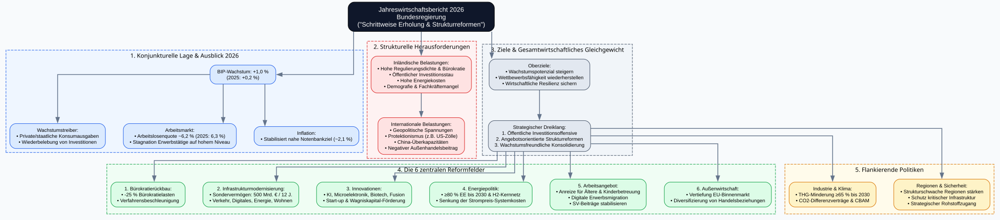
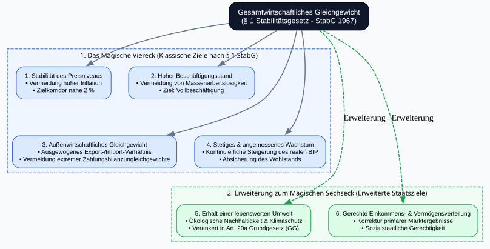
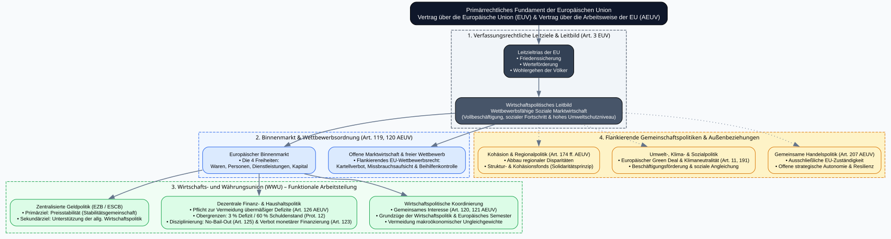

# Womit befasst sich die Wirtschaftspolitik

## Was sagt die Bundesregierung?

```{python}
#| output: false

import graphviz
from IPython.display import display

# Erstellung des gerichteten Graphviz-Diagramms
dot = graphviz.Digraph(
    'Jahreswirtschaftsbericht_2026',
    comment='Übersicht Jahreswirtschaftsbericht 2026',
    format='svg'
)

# Globale Layout-Einstellungen
dot.attr(
    rankdir='TB',
   splines='ortho',
    nodesep='0.5',
    ranksep='0.7',
    fontname='Arial',
    fontsize='12',
    bgcolor='#F8FAFC'
)

# Standard-Node-Styling
dot.attr('node', shape='rect', style='filled,rounded', fontname='Arial', fontsize='10', margin='0.2,0.1')
dot.attr('edge', color='#64748B', penwidth='1.5')

# Hauptknoten (Titel)
dot.node(
    'root',
    'Jahreswirtschaftsbericht 2026\nBundesregierung\n("Schrittweise Erholung & Strukturreformen")',
    fillcolor='#0F172A',
    fontcolor='#FFFFFF',
    fontsize='13',
    style='filled,rounded'
)

# --- 1. Konjunkturelle Lage ---
with dot.subgraph(name='cluster_konjunktur') as c:
    c.attr(label='1. Konjunkturelle Lage & Ausblick 2026', style='filled,dashed', fillcolor='#EFF6FF', color='#2563EB', fontname='Arial-Bold')
    c.node('bip', 'BIP-Wachstum: +1,0 %\n(2025: +0,2 %)', fillcolor='#DBEAFE', color='#2563EB')
    c.node('treiber', 'Wachstumstreiber:\n• Private/staatliche Konsumausgaben\n• Wiederbelebung von Investitionen', fillcolor='#DBEAFE', color='#2563EB')
    c.node('arbeitsmarkt', 'Arbeitsmarkt:\n• Arbeitslosenquote ~6,2 % (2025: 6,3 %)\n• Stagnation Erwerbstätige auf hohem Niveau', fillcolor='#DBEAFE', color='#2563EB')
    c.node('inflation', 'Inflation:\n• Stabilisiert nahe Notenbankziel (~2,1 %)', fillcolor='#DBEAFE', color='#2563EB')

# --- 2. Strukturelle Herausforderungen ---
with dot.subgraph(name='cluster_herausforderungen') as c:
    c.attr(label='2. Strukturelle Herausforderungen', style='filled,dashed', fillcolor='#FEF2F2', color='#DC2626', fontname='Arial-Bold')
    c.node('inland', 'Inländische Belastungen:\n• Hohe Regulierungsdichte & Bürokratie\n• Öffentlicher Investitionsstau\n• Hohe Energiekosten\n• Demografie & Fachkräftemangel', fillcolor='#FEE2E2', color='#DC2626')
    c.node('aussen', 'Internationale Belastungen:\n• Geopolitische Spannungen\n• Protektionismus (z.B. US-Zölle)\n• China-Überkapazitäten\n• Negativer Außenhandelsbeitrag', fillcolor='#FEE2E2', color='#DC2626')

# --- 3. Strategische Ziele & Dreiklang ---
with dot.subgraph(name='cluster_strategie') as c:
    c.attr(label='3. Ziele & Gesamtwirtschaftliches Gleichgewicht', style='filled,dashed', fillcolor='#F1F5F9', color='#475569', fontname='Arial-Bold')
    c.node('ziele', 'Oberziele:\n• Wachstumspotenzial steigern\n• Wettbewerbsfähigkeit wiederherstellen\n• Wirtschaftliche Resilienz sichern', fillcolor='#E2E8F0', color='#475569')
    c.node('dreiklang', 'Strategischer Dreiklang:\n1. Öffentliche Investitionsoffensive\n2. Angebotsorientierte Strukturreformen\n3. Wachstumsfreundliche Konsolidierung', fillcolor='#E2E8F0', color='#475569')

# --- 4. Die 6 Reformfelder ---
with dot.subgraph(name='cluster_reformen') as c:
    c.attr(label='4. Die 6 zentralen Reformfelder', style='filled,dashed', fillcolor='#F0FDF4', color='#16A34A', fontname='Arial-Bold')
    c.node('r1', '1. Bürokratierückbau:\n• -25 % Bürokratielasten\n• Verfahrensbeschleunigung', fillcolor='#DCFCE7', color='#16A34A')
    c.node('r2', '2. Infrastrukturmodernisierung:\n• Sondervermögen: 500 Mrd. € / 12 J.\n• Verkehr, Digitales, Energie, Wohnen', fillcolor='#DCFCE7', color='#16A34A')
    c.node('r3', '3. Innovationen:\n• KI, Microelektronik, Biotech, Fusion\n• Start-up & Wagniskapital-Förderung', fillcolor='#DCFCE7', color='#16A34A')
    c.node('r4', '4. Energiepolitik:\n• ≥80 % EE bis 2030 & H2-Kernnetz\n• Senkung der Strompreis-Systemkosten', fillcolor='#DCFCE7', color='#16A34A')
    c.node('r5', '5. Arbeitsangebot:\n• Anreize für Ältere & Kinderbetreuung\n• Digitale Erwerbsmigration\n• SV-Beiträge stabilisieren', fillcolor='#DCFCE7', color='#16A34A')
    c.node('r6', '6. Außenwirtschaft:\n• Vertiefung EU-Binnenmarkt\n• Diversifizierung von Handelsbeziehungen', fillcolor='#DCFCE7', color='#16A34A')

# --- 5. Flankierende Politiken ---
with dot.subgraph(name='cluster_flankierend') as c:
    c.attr(label='5. Flankierende Politiken', style='filled,dashed', fillcolor='#FFFBEB', color='#D97706', fontname='Arial-Bold')
    c.node('klima', 'Industrie & Klima:\n• THG-Minderung ≥65 % bis 2030\n• CO2-Differenzverträge & CBAM', fillcolor='#FEF3C7', color='#D97706')
    c.node('sicherheit', 'Regionen & Sicherheit:\n• Strukturschwache Regionen stärken\n• Schutz kritischer Infrastruktur\n• Strategischer Rohstoffzugang', fillcolor='#FEF3C7', color='#D97706')

# --- KANTEN / VERBINDUNGEN ---
# Root Verbindungen
dot.edge('root', 'bip')
dot.edge('root', 'inland')
dot.edge('root', 'ziele')

# Konjunktur Verbindungen
dot.edge('bip', 'treiber')
dot.edge('bip', 'arbeitsmarkt')
dot.edge('bip', 'inflation')

# Herausforderungen Verbindungen
dot.edge('inland', 'aussen')

# Strategie zu Reformfeldern
dot.edge('ziele', 'dreiklang')
dot.edge('dreiklang', 'r1')
dot.edge('dreiklang', 'r2')
dot.edge('dreiklang', 'r3')
dot.edge('dreiklang', 'r4')
dot.edge('dreiklang', 'r5')
dot.edge('dreiklang', 'r6')

# Verbindungen zu flankierenden Maßnahmen
dot.edge('dreiklang', 'klima')
dot.edge('dreiklang', 'sicherheit')

# Grafik im Arbeitsverzeichnis als SVG speichern
dot.render('jahreswirtschaftsbericht_2026', format='svg', cleanup=True)

# Ausgabe direkt im Jupyter/IPython Notebook
#display(dot)
```


## Was sagt das deutsche Recht?

```{python}
#| output: false

import graphviz
# from IPython.display import display

# Erstellung des gerichteten Graphviz-Diagramms
dot = graphviz.Digraph(
    'magisches_sechseck',
    comment='Wirtschaftspolitische Ziele in Deutschland - Magisches Viereck und Sechseck',
    format='svg'
)

# Globale Layout-Einstellungen
dot.attr(
    rankdir='TB',
    nodesep='0.4',
    ranksep='0.6',
    fontname='Arial',
    fontsize='11',
    bgcolor='#F8FAFC'
)

# Standard-Styling für Knoten und Kanten
dot.attr('node', shape='rect', style='filled,rounded', fontname='Arial', fontsize='10', margin='0.2,0.12')
dot.attr('edge', color='#64748B', penwidth='1.5')

# Oberziel: Gesamtwirtschaftliches Gleichgewicht
dot.node(
    'oberziel',
    'Gesamtwirtschaftliches Gleichgewicht\n(§ 1 Stabilitätsgesetz - StabG 1967)',
    fillcolor='#0F172A',
    fontcolor='#FFFFFF',
    fontsize='12',
    style='filled,rounded'
)

# --- 1. DAS MAGISCHE VIERECK (Klassische Ziele nach § 1 StabG) ---
with dot.subgraph(name='cluster_viereck') as c:
    c.attr(
        label='1. Das Magische Viereck (Klassische Ziele nach § 1 StabG)',
        style='filled,dashed',
        fillcolor='#EFF6FF',
        color='#2563EB',
        fontname='Arial-Bold'
    )

    c.node('z1', '1. Stabilität des Preisniveaus\n• Vermeidung hoher Inflation\n• Zielkorridor nahe 2 %', fillcolor='#DBEAFE', color='#2563EB')
    c.node('z2', '2. Hoher Beschäftigungsstand\n• Vermeidung von Massenarbeitslosigkeit\n• Ziel: Vollbeschäftigung', fillcolor='#DBEAFE', color='#2563EB')
    c.node('z3', '3. Außenwirtschaftliches Gleichgewicht\n• Ausgewogenes Export-/Import-Verhältnis\n• Vermeidung extremer Zahlungsbilanzungleichgewichte', fillcolor='#DBEAFE', color='#2563EB')
    c.node('z4', '4. Stetiges & angemessenes Wachstum\n• Kontinuierliche Steigerung des realen BIP\n• Absicherung des Wohlstands', fillcolor='#DBEAFE', color='#2563EB')

    # Anordnung der 4 Ziele in einem 2x2 Viereck
    with c.subgraph() as row1:
        row1.attr(rank='same')
        row1.node('z1'); row1.node('z2')
    with c.subgraph() as row2:
        row2.attr(rank='same')
        row2.node('z3'); row2.node('z4')

    # Unsichtbare Kanten, um die Viereck-Form zu erzwingen und die Spalten zu erhalten
    c.edge('z1', 'z3', style='invis')
    c.edge('z2', 'z4', style='invis')

# --- 2. ERWEITERUNG ZUM MAGISCHEN SECHSECK (Moderne Staatsziele) ---
with dot.subgraph(name='cluster_sechseck') as c:
    c.attr(
        label='2. Erweiterung zum Magischen Sechseck (Erweiterte Staatsziele)',
        style='filled,dashed',
        fillcolor='#F0FDF4',
        color='#16A34A',
        fontname='Arial-Bold'
    )

    c.node('z5', '5. Erhalt einer lebenswerten Umwelt\n• Ökologische Nachhaltigkeit & Klimaschutz\n• Verankert in Art. 20a Grundgesetz (GG)', fillcolor='#DCFCE7', color='#16A34A')
    c.node('z6', '6. Gerechte Einkommens- & Vermögensverteilung\n• Korrektur primärer Marktergebnisse\n• Sozialstaatliche Gerechtigkeit', fillcolor='#DCFCE7', color='#16A34A')

    # Anordnung der 2 Erweiterungsziele auf gleicher Höhe
    with c.subgraph() as s_sub:
        s_sub.attr(rank='same')
        s_sub.node('z5'); s_sub.node('z6')

# --- KANTEN / HIERARCHISCHE VERBINDUNGEN ---
# Unsichtbare Kanten, um z5 und z6 unter z3 und z4 zu platzieren
dot.edge('z3', 'z5', style='invis')
dot.edge('z4', 'z6', style='invis')

# Verbindungen zum Magischen Viereck (durchgezogen)
dot.edge('oberziel', 'z1')
dot.edge('oberziel', 'z2')
dot.edge('oberziel', 'z3')
dot.edge('oberziel', 'z4')

# Verbindungen zur Erweiterung des Magischen Sechsecks (gestrichelt)
dot.edge('oberziel', 'z5', style='dashed', color='#16A34A', label='Erweiterung')
dot.edge('oberziel', 'z6', style='dashed', color='#16A34A', label='Erweiterung')

# Speichern der Grafik als SVG-Datei
dot.render('magisches_sechseck_ziele', format='svg', cleanup=True)

# Ausgabe im IPython / Jupyter Notebook
#display(dot)
```



## Was sagt das europäische Recht?

```{python}
#| output: false

import graphviz
# from IPython.display import display

# Erstellung des gerichteten Graphviz-Diagramms
dot = graphviz.Digraph(
    'EU_Wirtschaftspolitische_Ziele',
    comment='Wirtschaftspolitische Ziele und Ordnung der Europäischen Union (EUV / AEUV)',
    format='svg'
)

# Globale Layout-Einstellungen
dot.attr(
    rankdir='TB',
    nodesep='0.35',
    ranksep='0.55',
    fontname='Arial',
    fontsize='11',
    bgcolor='#F8FAFC'
)

# Standard-Styling für Knoten und Kanten
dot.attr('node', shape='rect', style='filled,rounded', fontname='Arial', fontsize='10', margin='0.2,0.12')
dot.attr('edge', color='#64748B', penwidth='1.5')

# --- OBERSTE EBENE: Primärrechtliches Fundament ---
dot.node(
    'fundament',
    'Primärrechtliches Fundament der Europäischen Union\nVertrag über die Europäische Union (EUV) & Vertrag über die Arbeitsweise der EU (AEUV)',
    fillcolor='#0F172A',
    fontcolor='#FFFFFF',
    fontsize='12',
    style='filled,rounded'
)

# --- 1. EBENE: Leitzieltrias & Leitbild ---
with dot.subgraph(name='cluster_leitziele') as c:
    c.attr(
        label='1. Verfassungsrechtliche Leitziele & Leitbild (Art. 3 EUV)',
        style='filled,dashed',
        fillcolor='#F1F5F9',
        color='#334155',
        fontname='Arial-Bold'
    )
    c.node('trias', 'Leitzieltrias der EU\n• Friedenssicherung\n• Werteförderung\n• Wohlergehen der Völker', fillcolor='#334155', fontcolor='#FFFFFF')
    c.node('leitbild', 'Wirtschaftspolitisches Leitbild\nWettbewerbsfähige Soziale Marktwirtschaft\n(Vollbeschäftigung, sozialer Fortschritt & hohes Umweltschutzniveau)', fillcolor='#475569', fontcolor='#FFFFFF')

# --- 2. EBENE: Binnenmarkt & Ordnungspolitik ---
with dot.subgraph(name='cluster_binnenmarkt') as c:
    c.attr(
        label='2. Binnenmarkt & Wettbewerbsordnung (Art. 119, 120 AEUV)',
        style='filled,dashed',
        fillcolor='#EFF6FF',
        color='#2563EB',
        fontname='Arial-Bold'
    )
    c.node('binnenmarkt', 'Europäischer Binnenmarkt\n• Die 4 Freiheiten:\n  Waren, Personen, Dienstleistungen, Kapital', fillcolor='#DBEAFE', color='#2563EB')
    c.node('ordnung', 'Offene Marktwirtschaft & freier Wettbewerb\n• Flankierendes EU-Wettbewerbsrecht:\n  Kartellverbot, Missbrauchsaufsicht & Beihilfenkontrolle', fillcolor='#DBEAFE', color='#2563EB')

# --- 3. EBENE: Wirtschafts- und Währungsunion (WWU) ---
with dot.subgraph(name='cluster_wwu') as c:
    c.attr(
        label='3. Wirtschafts- und Währungsunion (WWU) – Funktionale Arbeitsteilung',
        style='filled,dashed',
        fillcolor='#F0FDF4',
        color='#16A34A',
        fontname='Arial-Bold'
    )

    c.node('geldpolitik', 'Zentralisierte Geldpolitik (EZB / ESCB)\n• Primärziel: Preisstabilität (Stabilitätsgemeinschaft)\n• Sekundärziel: Unterstützung der allg. Wirtschaftspolitik', fillcolor='#DCFCE7', color='#16A34A')
    c.node('fiskalpolitik', 'Dezentrale Finanz- & Haushaltspolitik\n• Pflicht zur Vermeidung übermäßiger Defizite (Art. 126 AEUV)\n• Obergrenzen: 3 % Defizit / 60 % Schuldenstand (Prot. 12)\n• Disziplinierung: No-Bail-Out (Art. 125) & Verbot monetärer Finanzierung (Art. 123)', fillcolor='#DCFCE7', color='#16A34A')
    c.node('koordinierung', 'Wirtschaftspolitische Koordinierung\n• Gemeinsames Interesse (Art. 120, 121 AEUV)\n• Grundzüge der Wirtschaftspolitik & Europäisches Semester\n• Vermeidung makroökonomischer Ungleichgewichte', fillcolor='#DCFCE7', color='#16A34A')

    with c.subgraph() as wwu_sub:
        wwu_sub.attr(rank='same')
        wwu_sub.node('geldpolitik')
        wwu_sub.node('fiskalpolitik')
        wwu_sub.node('koordinierung')

# --- 4. EBENE: Flankierende Gemeinschaftspolitiken ---
with dot.subgraph(name='cluster_politiken') as c:
    c.attr(
        label='4. Flankierende Gemeinschaftspolitiken & Außenbeziehungen',
        style='filled,dashed',
        fillcolor='#FEF3C7',
        color='#D97706',
        fontname='Arial-Bold'
    )

    c.node('kohesion', 'Kohäsion & Regionalpolitik (Art. 174 ff. AEUV)\n• Abbau regionaler Disparitäten\n• Struktur- & Kohäsionsfonds (Solidaritätsprinzip)', fillcolor='#FEF3C7', color='#D97706')
    c.node('klima_sozial', 'Umwelt-, Klima- & Sozialpolitik\n• Europäischer Green Deal & Klimaneutralität (Art. 11, 191)\n• Beschäftigungsförderung & soziale Angleichung', fillcolor='#FEF3C7', color='#D97706')
    c.node('handel', 'Gemeinsame Handelspolitik (Art. 207 AEUV)\n• Ausschließliche EU-Zuständigkeit\n• Offene strategische Autonomie & Resilienz', fillcolor='#FEF3C7', color='#D97706')

    with c.subgraph() as pol_sub:
        pol_sub.attr(rank='same')
        pol_sub.node('kohesion')
        pol_sub.node('klima_sozial')
        pol_sub.node('handel')

# --- HIERARCHISCHE KANTENVERBINDUNGEN ---
dot.edge('fundament', 'trias')
dot.edge('trias', 'leitbild')

dot.edge('leitbild', 'binnenmarkt')
dot.edge('leitbild', 'ordnung')

dot.edge('binnenmarkt', 'geldpolitik')
dot.edge('binnenmarkt', 'fiskalpolitik')
dot.edge('binnenmarkt', 'koordinierung')

dot.edge('leitbild', 'kohesion', style='dotted')
dot.edge('leitbild', 'klima_sozial', style='dotted')
dot.edge('leitbild', 'handel', style='dotted')

# Speichern der Grafik als SVG-Datei
dot.render('eu_wirtschaftspolitische_ziele', format='svg', cleanup=True)

# Ausgabe im Jupyter / IPython Notebook
# display(dot)
```


## Was sagen die Lehrbücher?

